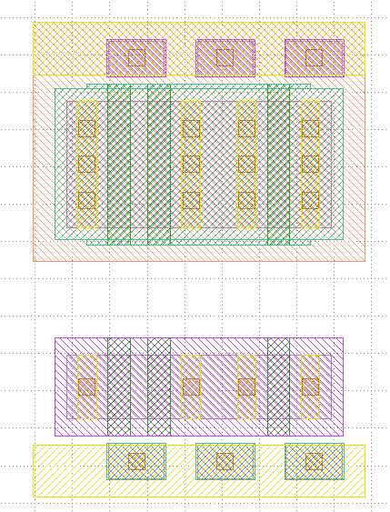

# GF180 Standard Cell Template PCell for KLayout

When designing standard cells for GF180, the PDK-provided transistor PCells are less than ideal because they lack some options for the placement of well taps, or they generate unnecessary Poly-Metal1 vias at the terminals of the gate. It is also not possible to generate dual-gate transistors.

To make the life easier for standard cell designers, we've written a PCell that generates the transistor structures 
for standard cells. The standard cells generated with this PCell are designed to be used with either the OSU 3.3V 9- 
or 12-track library. They also try to imitated dimensions as much as possible.

The PCell is DRC-clean except for one well tap. However, that DRC violation is also found in all other OSU 
standard cells. Designing a full standard cell using this PCell has successfully been tested by designing an inverter.

USE AT YOUR OWN RISK!

## Installation
- Download this repository
- Add the `klayout` directory in the repository to your `KLAYOUT_PATH` environment variable. 
- Start KLayout. This could look like this when setting the environment variable on the command line:
  `KLAYOUT_PATH=/path/to/repo/klayout:$KLAYOUT_PATH klayout`

## Usage
There should be a new library that offers a single PCell. Drag it on the main screen to place it.

In the PCell parameters, the number of tracks and the transistor rows can be adjusted.

Transistor rows are configured as a string. A `c` character generates a contact, a `g` a gate. A simple transistor 
would then be `cgc` for a contact-gate-contact structure, or `cggc`for a transistor with two gate. It is also 
possible to merge two transistors with a common terminal: `cgcgc` generates a contact followed by a gate, contact, 
gate, and contact.

It is possible to include whitespace in the transistor row string for formatting.